<div align="center">

# 🚀 Portfolio Site v1.0

### A Modern, Dark-Themed Developer Portfolio

*Built with Astro • Powered by Cloudflare Workers • Deployed on GitHub Pages*

[](https://github.com/manideepsp/Portfolio-ManideepSP/releases/tag/v1.0.0)
[](https://manideepsp.github.io/Portfolio-ManideepSP)
[](https://astro.build)
[](LICENSE)

[](https://github.com/manideepsp/Portfolio-ManideepSP)
[](https://github.com/manideepsp/Portfolio-ManideepSP/fork)

---

**[🌐 Live Demo](https://manideepsp.github.io/Portfolio-ManideepSP)** • **[📖 Documentation](#-installation)** • **[🐛 Report Bug](https://github.com/manideepsp/Portfolio-ManideepSP/issues)** • **[✨ Request Feature](https://github.com/manideepsp/Portfolio-ManideepSP/issues)**

</div>

---

## 📋 Table of Contents

- [Project Overview](#-project-overview)
- [Architecture](#-architecture)
- [System Flowcharts](#-system-flowcharts)
- [Features](#-features)
- [Tech Stack](#-tech-stack)
- [Project Structure](#-project-structure)
- [Installation](#-installation)
- [Configuration](#-configuration)
- [Usage](#-usage)
- [Deployment](#-deployment)
- [Troubleshooting](#-troubleshooting)
- [Future Enhancements](#-future-enhancements)
- [Contributing](#-contributing)
- [License](#-license)
- [Author](#-author)
- [Acknowledgments](#-acknowledgments)

---

## 🎯 Project Overview

### What It Does

This portfolio website serves as a comprehensive professional showcase, designed specifically for software engineers, data scientists, and ML practitioners. It automatically fetches and displays project READMEs from GitHub repositories, manages multiple resume versions, and provides an innovative contact form system using GitHub Issues as a backend.

### Core Purpose and Goals

| Goal | Description |
|------|-------------|
| 🎯 **Recruiter-Friendly** | Streamlined UX designed for hiring managers and technical recruiters |
| 📊 **Data-Driven Content** | Projects, experience, and skills managed through configuration files and markdown |
| 🎨 **Modern Aesthetic** | Dark theme with neon cyan accents, glass-morphism effects, and scroll-reveal animations |
| 💰 **Zero-Cost Infrastructure** | Static site deployment with serverless contact form via Cloudflare Workers |
| 🔄 **Automated Updates** | CI/CD pipeline rebuilds site automatically when content changes |
| 🔒 **Privacy-First Contact** | Contact form creates GitHub Issues - no database, no third-party services |

### Key Highlights

- ✅ **100% Static** - No server-side runtime required
- ✅ **Lighthouse Score 95+** - Optimized performance out of the box
- ✅ **Mobile-First** - Fully responsive design
- ✅ **SEO Optimized** - Proper meta tags, sitemap, and semantic HTML
- ✅ **Accessible** - Keyboard navigation and screen reader support
- ✅ **Customizable** - Single config file for all personalization

---

## 🏗 Architecture

### High-Level System Architecture

The portfolio follows a **static-first architecture** using Astro's build-time rendering capabilities combined with serverless functions for dynamic features.

```mermaid
graph TB
    subgraph "Content Sources"
        A[📄 config.json] --> B[Astro Build]
        C[📝 Markdown Files] --> B
        D[📊 CSV Data] --> B
        E[🐙 GitHub READMEs] --> B
    end

    subgraph "Build Process"
        B --> F[Static HTML/CSS/JS]
    end

    subgraph "Hosting"
        F --> G[GitHub Pages CDN]
    end

    subgraph "Runtime Services"
        H[📧 Contact Form] --> I[Cloudflare Worker]
        I --> J[GitHub API]
        J --> K[GitHub Actions]
        K --> L[GitHub Issues]
    end

    subgraph "User"
        M[🌐 Browser] --> G
        M --> H
    end
```



### Component Architecture


### Data Flow Architecture


### ASCII Architecture Diagram

For environments that don't support Mermaid:

```
┌─────────────────────────────────────────────────────────────────────────────┐
│                           PORTFOLIO SITE ARCHITECTURE                        │
├─────────────────────────────────────────────────────────────────────────────┤
│                                                                             │
│  ┌─────────────────┐     ┌──────────────────┐     ┌─────────────────────┐  │
│  │  CONTENT LAYER  │     │   BUILD LAYER    │     │   HOSTING LAYER     │  │
│  ├─────────────────┤     ├──────────────────┤     ├─────────────────────┤  │
│  │                 │     │                  │     │                     │  │
│  │ • config.json   │────▶│  Astro SSG       │────▶│  GitHub Pages       │  │
│  │ • about.md      │     │  ─────────────   │     │  ──────────────     │  │
│  │ • experience.md │     │  • Parse MD      │     │  • Global CDN       │  │
│  │ • skills.csv    │     │  • Fetch READMEs │     │  • HTTPS            │  │
│  │ • GitHub APIs   │     │  • Process CSS   │     │  • Custom Domain    │  │
│  │                 │     │  • Bundle JS     │     │                     │  │
│  └─────────────────┘     └──────────────────┘     └─────────────────────┘  │
│                                                                             │
│  ┌─────────────────────────────────────────────────────────────────────┐   │
│  │                    CONTACT FORM FLOW                                 │   │
│  ├─────────────────────────────────────────────────────────────────────┤   │
│  │                                                                      │   │
│  │   ┌────────┐      ┌────────────┐      ┌─────────┐      ┌─────────┐  │   │
│  │   │ Form   │─────▶│ Cloudflare │─────▶│ GitHub  │─────▶│ GitHub  │  │   │
│  │   │ Submit │      │ Worker     │      │ Actions │      │ Issue   │  │   │
│  │   └────────┘      └────────────┘      └─────────┘      └─────────┘  │   │
│  │                          │                                           │   │
│  │                          ▼                                           │   │
│  │                   ┌────────────┐                                     │   │
│  │                   │ Fallback:  │                                     │   │
│  │                   │ Direct GH  │                                     │   │
│  │                   │ Issue Link │                                     │   │
│  │                   └────────────┘                                     │   │
│  └─────────────────────────────────────────────────────────────────────┘   │
│                                                                             │
└─────────────────────────────────────────────────────────────────────────────┘
```

---

## 🔄 System Flowcharts

### Build Process Flow

This flowchart shows how content is processed during `npm run build`:


### Contact Form Submission Flow

This flowchart shows the complete journey of a contact form submission:


### Page Navigation Flow

```mermaid
flowchart LR
    subgraph "Navigation"
        HOME[🏠 Home] --> PROJ[📁 Projects]
        PROJ --> DETAIL[📄 Project Detail]
        HOME --> ABOUT[👤 About]
        HOME --> RESUME[📄 Resume]
        HOME --> CONTACT[📧 Contact]
    end
    
    subgraph "Project Detail"
        DETAIL --> README[Rendered README]
        DETAIL --> LINKS[GitHub/Demo Links]
        DETAIL --> TECH[Tech Stack Tags]
    end
```



### Data Transformation Pipeline


### Runtime JavaScript Flow


---

## ✨ Features

### 1. **Dynamic Project Showcase**
- **Automatic README Fetching**: Pulls project documentation directly from GitHub repositories at build time
- **Glass-Card Design**: Projects displayed in modern glass-morphism cards with hover effects
- **Lazy Image Loading**: Project thumbnails optimized for performance
- **Technical Details**: Automatically extracts and displays tech stack, features, and project descriptions

**How it works**: The `fetchReadme()` function in `src/lib/readmeFetcher.js` makes build-time requests to `raw.githubusercontent.com` to fetch README.md files from public repositories listed in `config.json`. The markdown is then sanitized and rendered using the `remark` and `rehype` processing pipeline.

### 2. **Multi-Resume Management**
- **Version Switching**: Store and toggle between different resume variants (general, data engineer, ML engineer, etc.)
- **Inline PDF Viewer**: View resumes directly in the browser without downloading
- **Direct Download**: One-click download for any resume version
- **Responsive Display**: Mobile-optimized PDF viewing experience

**Implementation**: Resume PDFs are stored in `/public/resumes/` and managed through the `ResumeViewer.astro` component, which provides a native PDF embed with fallback options.

### 3. **GitHub Issues Contact Form**
- **Serverless Backend**: Uses Cloudflare Workers to proxy form submissions
- **Repository Dispatch**: Triggers GitHub Actions workflow to create issues
- **Spam Protection**: Server-side validation and rate limiting
- **Fallback Mechanism**: Automatic redirect to GitHub Issues if Worker fails
- **No Database Required**: All contact requests stored as GitHub Issues with proper labeling

**Technical Flow**:
```javascript
Form Submit → Cloudflare Worker → GitHub API (repository_dispatch)
                ↓
GitHub Actions listens for dispatch event
                ↓
Creates issue with contact details and label
                ↓
Email notification sent to repository owner
```

### 4. **Interactive Experience Timeline**
- **Chronological Display**: Work experience presented in vertical timeline format
- **Date Flexibility**: Configurable month display (show/hide months)
- **Markdown Support**: Rich formatting for role descriptions
- **Scroll Animations**: Smooth reveal animations as user scrolls

**Data Source**: Content pulled from `/content/experience.md` and parsed at build time.

### 5. **Skills Visualization**
- **CSV-Driven**: Skills managed in `content/skills.csv` for easy updates
- **Category Grouping**: Skills organized by technology stack (languages, frameworks, tools)
- **Badge Display**: Modern badge-style UI for quick scanning
- **Lightweight Parser**: Custom CSV parser (`csvParser.js`) with zero external dependencies

### 6. **Scroll-Reveal Animations**
- **Progressive Disclosure**: Content fades in as user scrolls
- **Performance Optimized**: Uses Intersection Observer API
- **Customizable Delays**: Staggered animations for list items
- **Configurable Duration**: Fine-tune animation timing per component

**Library**: ScrollReveal.js (4.0.9) wrapped in Astro component for SSR compatibility.

### 7. **Cursor Spotlight Effect**
- **Interactive Light**: Radial gradient follows cursor position
- **GPU Accelerated**: Uses CSS transforms for smooth 60fps performance
- **Responsive**: Automatically disabled on touch devices
- **Customizable**: Gradient colors and blur radius configurable in CSS

### 8. **Responsive Navigation**
- **Sticky Header**: Transparent nav with backdrop blur effect
- **Mobile Menu**: Hamburger menu for small screens
- **Active State**: Current page highlighted in navigation
- **Smooth Transitions**: Page transitions with fade effects

### 9. **SEO & Performance**
- **Meta Tags**: Comprehensive Open Graph and Twitter Card support
- **Sitemap Generation**: Automatic sitemap.xml creation
- **Asset Optimization**: Image compression and lazy loading
- **Lighthouse Score**: 95+ performance on all pages
- **Semantic HTML**: Proper heading hierarchy and ARIA labels

### 10. **Content Management**
- **Markdown-First**: All long-form content written in markdown
- **Config-Driven**: Site metadata managed in JSON
- **Version Controlled**: All content tracked in Git
- **Hot Reload**: Development server updates instantly on content changes

---

## 🛠 Tech Stack

### Core Framework
- **[Astro 5.16.4](https://astro.build)** - Static Site Generator
  - *Why*: Zero-JS by default, excellent DX, fast builds, MDX support, built-in asset optimization
  - *Features Used*: File-based routing, component islands, build-time data fetching

### UI & Styling
- **[Tailwind CSS 3.x](https://tailwindcss.com)** - Utility-First CSS Framework
  - *Why*: Rapid prototyping, consistent design system, purged CSS for minimal bundle size
- **Custom CSS Variables** (`vars.css`) - Theme management
- **Glass-morphism Effects** - Modern UI aesthetics with backdrop filters

### Content Processing
- **[Remark](https://github.com/remarkjs/remark)** - Markdown Processor
  - `remark-parse`: Markdown → AST
  - `remark-rehype`: AST → HTML AST
- **[Rehype](https://github.com/rehypejs/rehype)** - HTML Processor
  - `rehype-sanitize`: XSS protection
  - `rehype-stringify`: HTML generation
- **[Unified](https://github.com/unifiedjs/unified)** - Pipeline orchestration

### Animations & Interactivity
- **[ScrollReveal.js 4.0.9](https://scrollrevealjs.org/)** - Scroll animations
  - *Why*: Lightweight (3kb gzipped), no dependencies, Intersection Observer based
- **Custom Cursor Light** - Vanilla JavaScript with CSS transform

### Backend & Infrastructure
- **[Cloudflare Workers](https://workers.cloudflare.com/)** - Serverless functions
  - *Why*: Free tier, global edge network, zero cold starts, 100k requests/day
  - *Usage*: Contact form proxy and validation
- **[GitHub Actions](https://github.com/features/actions)** - CI/CD
  - Automated builds on push
  - Deploys to GitHub Pages
  - Creates issues from contact form dispatches
- **[GitHub Pages](https://pages.github.com/)** - Static hosting
  - *Why*: Free, HTTPS included, custom domain support, integrated with GitHub

### Development Tools
- **[ESLint](https://eslint.org/)** - JavaScript linter
- **[Prettier](https://prettier.io/)** - Code formatter
- **Node.js 18+** - Runtime environment

### Data Sources
- **GitHub API** - Project metadata and README fetching
- **Markdown Files** - About, experience content
- **CSV** - Skills data
- **JSON** - Site configuration

### Libraries & Dependencies
```json
{
  "astro": "^5.16.4",           // SSG framework
  "react": "^18.0.0",            // Component library (optional islands)
  "react-dom": "^18.0.0",        // React DOM renderer
  "scrollreveal": "^4.0.9",      // Scroll animations
  "rehype-sanitize": "^5.0.1",   // Security (XSS prevention)
  "remark": "^14.0.0",           // Markdown processing
  "unified": "^10.1.2"           // Content pipeline
}
```

---

## 📁 Project Structure

```
portfolio-site/
│
├── 📂 public/                          # Static assets (served as-is)
│   ├── 📂 resumes/                     # PDF resume files
│   │   ├── resume_latest.pdf           # Default resume
│   │   └── resume_data_engineer.pdf    # Specialized resume variant
│   ├── 📂 images/                      # Images and graphics
│   │   └── 📂 projects/                # Project thumbnails
│   └── 📂 og/                          # Open Graph images for social sharing
│
├── 📂 src/                             # Source code
│   ├── 📂 pages/                       # Astro pages (file-based routing)
│   │   ├── index.astro                 # Homepage (hero, projects, timeline)
│   │   ├── projects.astro              # Projects listing page
│   │   ├── projects_new.astro          # Experimental projects view
│   │   ├── resume.astro                # Resume viewer page
│   │   ├── about.astro                 # About/bio page
│   │   └── contact.astro               # Contact form page
│   │
│   ├── 📂 components/                  # Reusable Astro/React components
│   │   ├── Header.astro                # Site navigation header
│   │   ├── Footer.astro                # Site footer with links
│   │   ├── ProjectCard.astro           # Individual project card UI
│   │   ├── ProjectDetail.astro         # Expanded project view with README
│   │   ├── ProjectsTimeline.astro      # Timeline-style project display
│   │   ├── ExperienceTimeline.astro    # Work experience timeline
│   │   ├── Timeline.astro              # Generic timeline component
│   │   ├── MarkdownRenderer.astro      # Renders markdown with sanitization
│   │   ├── ResumeViewer.astro          # PDF viewer with download option
│   │   ├── ScrollRevealWrapper.astro   # HOC for scroll animations
│   │   └── CursorLight.astro           # Interactive cursor spotlight effect
│   │
│   ├── 📂 layouts/                     # Page layout templates
│   │   └── BaseLayout.astro            # Base HTML structure, meta tags, global styles
│   │
│   ├── 📂 lib/                         # Utility functions and configuration
│   │   ├── config.json                 # Site configuration (name, GitHub username, projects)
│   │   ├── readmeFetcher.js            # Fetches README from GitHub (public repos)
│   │   ├── csvParser.js                # Parses CSV files (skills data)
│   │   ├── markdown.js                 # Markdown-to-HTML processing pipeline
│   │   ├── githubForm.js               # Client-side form submission logic
│   │   └── sr.js                       # ScrollReveal initialization
│   │
│   └── 📂 styles/                      # Global styles
│       ├── global.css                  # Main stylesheet (layout, components)
│       └── vars.css                    # CSS custom properties (theme colors, fonts)
│
├── 📂 content/                         # Markdown and data files
│   ├── about.md                        # About page content
│   ├── experience.md                   # Work experience entries
│   └── skills.csv                      # Skills list (parsed at build time)
│
├── 📂 cloudflare-worker/               # Serverless backend
│   ├── contact-proxy.js                # Cloudflare Worker for contact form
│   └── README.md                       # Worker deployment instructions
│
├── 📂 .github/                         # GitHub automation
│   ├── 📂 workflows/                   # CI/CD workflows
│   │   ├── build_and_deploy.yml        # Build site and deploy to GitHub Pages
│   │   └── contact_issue_from_dispatch.yml  # Creates issues from contact form
│   └── 📂 scripts/                     # Helper scripts
│
├── 📄 astro.config.mjs                 # Astro configuration
├── 📄 package.json                     # Dependencies and scripts
├── 📄 tsconfig.json                    # TypeScript configuration
└── 📄 README.md                        # This file
```

### Key Files and Their Responsibilities

| File | Purpose |
|------|---------|
| `src/lib/config.json` | Central configuration for site metadata, GitHub username, project list, resume filenames |
| `src/lib/readmeFetcher.js` | Fetches README.md from GitHub repos at build time using raw.githubusercontent.com |
| `src/lib/markdown.js` | Processes markdown content using remark/rehype pipeline with sanitization |
| `src/lib/csvParser.js` | Zero-dependency CSV parser for skills.csv |
| `src/components/ScrollRevealWrapper.astro` | Wraps components with scroll-reveal animations |
| `cloudflare-worker/contact-proxy.js` | Serverless function that proxies contact form to GitHub API |
| `.github/workflows/build_and_deploy.yml` | Builds Astro site and deploys to GitHub Pages |
| `.github/workflows/contact_issue_from_dispatch.yml` | Listens for repository_dispatch and creates GitHub Issue |

---

## 📦 Installation

### Prerequisites

Ensure you have the following installed on your system:

- **Node.js**: Version 18.x or higher ([Download](https://nodejs.org/))
- **npm**: Version 9.x or higher (comes with Node.js)
- **Git**: For cloning the repository ([Download](https://git-scm.com/))
- **GitHub Account**: For deployment and contact form integration
- **Cloudflare Account** (Optional): For contact form worker deployment

### Step-by-Step Setup

1. **Clone the Repository**

   ```powershell
   git clone https://github.com/manideepsp/Portfolio-ManideepSP.git
   cd Portfolio-ManideepSP
   ```

2. **Install Dependencies**

   ```powershell
   npm install
   ```

   This installs all packages listed in `package.json`, including:
   - Astro framework
   - Remark/Rehype markdown processors
   - ScrollReveal for animations
   - Tailwind CSS and PostCSS

3. **Verify Installation**

   ```powershell
   node --version   # Should show v18.x or higher
   npm --version    # Should show v9.x or higher
   ```

4. **Initial Build Test**

   ```powershell
   npm run build
   ```

   This creates a `dist/` folder with static HTML files. If successful, you'll see:
   ```
   ✓ Built in XXXms
   ```

---

## ⚙️ Configuration

### Site Configuration (`src/lib/config.json`)

This is the central configuration file for your portfolio. Edit this file to customize your site:

```json
{
  "name": "Manideep SP",                    // Your display name
  "title": "Software Engineer • Data & ML", // Tagline/title
  "githubUsername": "manideepsp",           // Your GitHub username
  "resume": "resume_latest.pdf",            // Default resume filename
  "projectsRepoList": [                     // GitHub repos to showcase
    "manideepsp/project-1",
    "manideepsp/project-2"
  ],
  "customDomain": "",                       // Optional: yourdomain.com
  "contactWorkerUrl": "",                   // Cloudflare Worker URL (see below)
  "contactFallback": {
    "autoRedirect": true,                   // Auto-redirect to GitHub Issues if worker fails
    "delayMs": 5000,                        // Delay before redirect
    "showFallbackButton": true              // Show manual fallback button
  },
  "experience": {
    "showMonth": true,                      // Show months in timeline dates
    "defaultMonth": "Jan"                   // Default month if not specified
  }
}
```

### Environment Variables

For local development with private GitHub repositories or API access:

Create a `.env` file in the root directory (this file is gitignored):

```bash
# GitHub Personal Access Token (for private repo README fetching)
GH_README_TOKEN=ghp_your_token_here

# Cloudflare Worker URL (for contact form)
PUBLIC_CONTACT_WORKER_URL=https://contact-proxy.your-subdomain.workers.dev
```

⚠️ **Security Note**: NEVER commit the `.env` file or expose your GitHub token in client-side code.

### Astro Configuration (`astro.config.mjs`)

```javascript
export default {
  site: 'https://your-portfolio-url.com',   // Your site URL (for sitemap)
  base: '/',                                // Base path (use '/repo-name' for GitHub Pages)
  buildOptions: {
    outDir: 'dist',                         // Build output directory
  },
  markdown: {
    shikiConfig: {
      theme: 'nord',                        // Code syntax highlighting theme
    },
  },
  vite: {
    server: {
      port: 3000,                           // Development server port
    },
  },
};
```

### Content Configuration

#### 1. **Projects** (`src/lib/config.json`)

Add your GitHub repositories to the `projectsRepoList` array:

```json
"projectsRepoList": [
  "manideepsp/repo-name-1",
  "manideepsp/repo-name-2"
]
```

The site will automatically fetch README.md from each repository at build time.

#### 2. **Resume Files** (`public/resumes/`)

Place your PDF resumes in this directory:
- `resume_latest.pdf` - Your default resume
- `resume_data_engineer.pdf` - Specialized variant
- `resume_ml_engineer.pdf` - Another variant

Update `config.json` to set the default:
```json
"resume": "resume_latest.pdf"
```

#### 3. **About Content** (`content/about.md`)

Write your bio in markdown format:

```markdown
I'm a software engineer specializing in data infrastructure and machine learning systems.

I build scalable backend services and production ML pipelines...
```

#### 4. **Experience** (`content/experience.md`)

Format your work history:

```markdown
## Software Engineer | Company Name
**Jan 2023 - Present**

- Built distributed data processing pipelines handling 10M+ events/day
- Designed and deployed ML models for real-time fraud detection
- Technologies: Python, Spark, Kubernetes, TensorFlow
```

#### 5. **Skills** (`content/skills.csv`)

Create a CSV file with your skills:

```csv
category,skill,level
Languages,Python,Expert
Languages,JavaScript,Advanced
Frameworks,React,Advanced
Tools,Docker,Expert
```

### Cloudflare Worker Configuration

#### 1. **Deploy Worker**

```powershell
cd cloudflare-worker
wrangler publish
```

#### 2. **Set Environment Variable**

In Cloudflare dashboard or via CLI:

```powershell
wrangler secret put GLOBAL_GITHUB_TOKEN
# Paste your GitHub Personal Access Token (PAT)
```

**Creating a GitHub PAT**:
1. Go to GitHub Settings → Developer Settings → Personal Access Tokens → Tokens (classic)
2. Click "Generate new token (classic)"
3. Select scopes: `repo` (full control of private repositories)
4. Copy the token (you won't see it again!)

#### 3. **Update Config**

Add the worker URL to `src/lib/config.json`:

```json
"contactWorkerUrl": "https://contact-proxy.your-subdomain.workers.dev"
```

### GitHub Actions Secrets

For automated deployments, add these secrets in your repository settings:

1. Go to: `Settings → Secrets and variables → Actions`
2. Add the following secrets:

| Secret Name | Value | Purpose |
|-------------|-------|---------|
| `GH_README_TOKEN` | GitHub PAT | Fetch private repo READMEs during build |
| `GITHUB_TOKEN` | Auto-provided | Deploy to GitHub Pages (no action needed) |

---

## 🚀 Usage

### Development Server

Start the local development server with hot reload:

```powershell
npm run dev
```

- **URL**: http://localhost:3000
- **Features**: Hot module replacement, instant updates on file changes
- **Console**: Shows build errors and warnings

### Build for Production

Create an optimized production build:

```powershell
npm run build
```

- **Output**: `dist/` folder with static HTML, CSS, JS
- **Optimizations**: Minification, asset bundling, image optimization
- **Validation**: Checks for broken links and missing assets

### Preview Production Build

Test the production build locally:

```powershell
npm run preview
```

- **URL**: http://localhost:4321 (different port than dev)
- **Purpose**: Verify production build works correctly before deployment

### Example Commands

```powershell
# Clean install (removes node_modules and reinstalls)
Remove-Item -Recurse -Force node_modules; npm install

# Build and preview in sequence
npm run build; npm run preview

# Check for outdated packages
npm outdated

# Update dependencies
npm update
```

### API Endpoints

This is a static site with no traditional API endpoints. However, the contact form interacts with:

**Cloudflare Worker Endpoint**:
```
POST https://contact-proxy.your-subdomain.workers.dev
Content-Type: application/json

{
  "name": "John Doe",
  "email": "john@example.com",
  "position": "Software Engineer",
  "message": "I'd like to discuss an opportunity...",
  "title": "Contact from Portfolio Site"
}
```

**Response**:
```json
{
  "ok": true
}
```

### Sample Input/Output

#### Project README Fetch

**Input** (`config.json`):
```json
"projectsRepoList": ["manideepsp/awesome-project"]
```

**Build-time Fetch**:
```javascript
const readme = await fetchReadme("manideepsp/awesome-project");
// Fetches from: https://raw.githubusercontent.com/manideepsp/awesome-project/main/README.md
```

**Output** (rendered on page):
```html
<article class="project-card">
  <h3>awesome-project</h3>
  <p>A comprehensive data pipeline for real-time analytics...</p>
  <a href="https://github.com/manideepsp/awesome-project">View Project →</a>
</article>
```

#### Skills CSV Parsing

**Input** (`content/skills.csv`):
```csv
category,skill,level
Languages,Python,Expert
```

**Parsing**:
```javascript
import { parseCSV } from './lib/csvParser.js';
const skills = parseCSV(csvText);
// Result: [{ category: "Languages", skill: "Python", level: "Expert" }]
```

---

## 🌐 Deployment

### Local Deployment

For testing on your local network:

```powershell
npm run build
npm run preview
```

Access from other devices on your network: `http://YOUR_LOCAL_IP:4321`

### GitHub Pages (Recommended)

#### Prerequisites
- GitHub repository
- GitHub Actions enabled
- `GH_README_TOKEN` secret configured (optional, for private repos)

#### Deployment Steps

1. **Enable GitHub Pages**
   - Go to repository `Settings → Pages`
   - Source: `GitHub Actions`

2. **Configure Base Path** (if not using custom domain)
   
   Edit `astro.config.mjs`:
   ```javascript
   export default {
     site: 'https://manideepsp.github.io',
     base: '/Portfolio-ManideepSP',  // Your repo name
   };
   ```

3. **Push to Main Branch**
   
   ```powershell
   git add .
   git commit -m "Deploy portfolio site"
   git push origin main
   ```

4. **Automatic Build**
   
   GitHub Actions will automatically:
   - Install dependencies
   - Fetch project READMEs
   - Build static site
   - Deploy to GitHub Pages

5. **Verify Deployment**
   
   - Check Actions tab for build status
   - Visit: `https://manideepsp.github.io/Portfolio-ManideepSP`

#### Custom Domain Setup

1. **Add CNAME File**
   
   Create `public/CNAME`:
   ```
   yourdomain.com
   ```

2. **Configure DNS**
   
   Add DNS records with your domain provider:
   ```
   Type: A
   Name: @
   Value: 185.199.108.153
   
   Type: A
   Name: @
   Value: 185.199.109.153
   
   Type: A
   Name: @
   Value: 185.199.110.153
   
   Type: A
   Name: @
   Value: 185.199.111.153
   
   Type: CNAME
   Name: www
   Value: manideepsp.github.io
   ```

3. **Enable HTTPS**
   
   In GitHub Pages settings, check "Enforce HTTPS"

### Cloudflare Workers (Contact Form)

Deploy the contact form proxy:

```powershell
cd cloudflare-worker
wrangler login
wrangler publish
```

Set the GitHub token secret:

```powershell
wrangler secret put GLOBAL_GITHUB_TOKEN
```

### CI/CD Notes

The `.github/workflows/build_and_deploy.yml` workflow runs on:
- Push to `main` branch
- Pull requests to `main` branch

**Workflow Steps**:
1. Checkout code
2. Setup Node.js 18
3. Install dependencies
4. Build Astro site
5. Deploy to `gh-pages` branch
6. Update GitHub Pages

**Environment Variables in CI**:
- `GITHUB_TOKEN`: Auto-provided by GitHub Actions
- `GH_README_TOKEN`: Manual secret for private repos

### Production Checklist

Before deploying to production:

- [ ] Update `config.json` with real data
- [ ] Add actual resume PDFs to `public/resumes/`
- [ ] Write `content/about.md` and `content/experience.md`
- [ ] Configure `astro.config.mjs` with correct site URL
- [ ] Test contact form with Cloudflare Worker
- [ ] Verify all project READMEs load correctly
- [ ] Check mobile responsiveness
- [ ] Run Lighthouse audit (aim for 90+ scores)
- [ ] Set up custom domain (optional)
- [ ] Configure GitHub Pages settings
- [ ] Test all navigation links

---

## 🐛 Troubleshooting

### Common Issues and Fixes

#### 1. **README Fetch Fails During Build**

**Symptom**: Build succeeds but projects show "README not available"

**Causes**:
- Repository is private (raw.githubusercontent.com doesn't work with private repos)
- Repository doesn't have README.md in root
- Branch name is not `main` (might be `master`)

**Solutions**:
```javascript
// In src/lib/readmeFetcher.js, try different branch
const readme = await fetchReadme('user/repo', 'master');

// Or add error handling
const readme = await fetchReadme('user/repo').catch(err => {
  console.error(`Failed to fetch ${repo}:`, err);
  return '# Project\n\nNo README available.';
});
```

For private repos, use GitHub Actions with `GH_README_TOKEN`:
```yaml
# .github/workflows/build_and_deploy.yml
env:
  GH_README_TOKEN: ${{ secrets.GH_README_TOKEN }}
```

#### 2. **Contact Form Returns 405 Error**

**Symptom**: Form submission fails with "Method Not Allowed"

**Cause**: Worker URL is incorrect or worker isn't deployed

**Solutions**:
1. Verify worker is deployed:
   ```powershell
   cd cloudflare-worker
   wrangler whoami  # Check you're logged in
   wrangler publish
   ```

2. Check `config.json` has correct URL:
   ```json
   "contactWorkerUrl": "https://contact-proxy.YOUR-SUBDOMAIN.workers.dev"
   ```

3. Test worker directly:
   ```powershell
   curl -X POST https://contact-proxy.YOUR-SUBDOMAIN.workers.dev `
     -H "Content-Type: application/json" `
     -d '{"name":"Test","email":"test@example.com","message":"Test"}'
   ```

#### 3. **GitHub Actions Build Fails**

**Symptom**: Actions tab shows red X on workflow run

**Common Errors**:

| Error | Cause | Solution |
|-------|-------|----------|
| `npm ERR! 404 Not Found` | Dependency version doesn't exist | Check `package.json`, run `npm install` locally first |
| `Error: No such file or directory` | File path issue | Verify file exists, check case sensitivity |
| `Permission denied` | GitHub token lacks permissions | Check `GITHUB_TOKEN` has `contents: write` permission |
| `Failed to fetch README` | Private repo without token | Add `GH_README_TOKEN` secret |

**Debug Steps**:
1. Check Actions logs for exact error message
2. Run the same commands locally:
   ```powershell
   npm ci        # Clean install (same as CI)
   npm run build
   ```
3. Verify secrets are set in repo settings

#### 4. **Styles Not Loading After Deployment**

**Symptom**: Site works locally but looks unstyled on GitHub Pages

**Cause**: Incorrect base path in config

**Solution**:
```javascript
// astro.config.mjs
export default {
  base: '/portfolio-site',  // Must match repo name
};
```

Or set `base: '/'` if using custom domain.

#### 5. **ScrollReveal Animations Don't Work**

**Symptom**: No animations on scroll

**Causes**:
- JavaScript not loading
- ScrollReveal not initialized
- Elements missing `data-sr` attribute

**Solutions**:
1. Check browser console for errors
2. Verify ScrollReveal is imported:
   ```astro
   ---
   import ScrollRevealWrapper from '../components/ScrollRevealWrapper.astro';
   ---
   <ScrollRevealWrapper>
     <div>Content</div>
   </ScrollRevealWrapper>
   ```

3. Check `src/lib/sr.js` is being called

#### 6. **PDF Resume Not Displaying**

**Symptom**: Resume page shows broken embed or download doesn't work

**Causes**:
- PDF file not in `/public/resumes/`
- Incorrect filename in `config.json`
- Browser blocking PDF embed

**Solutions**:
1. Verify file exists:
   ```powershell
   ls public/resumes/
   ```

2. Check filename matches config:
   ```json
   "resume": "resume_latest.pdf"  // Must match actual filename
   ```

3. Test direct URL: `http://localhost:3000/resumes/resume_latest.pdf`

### Known Limitations

1. **Private Repository READMEs**: Cannot fetch at build time using `raw.githubusercontent.com`. Must use GitHub Actions with API token.

2. **Contact Form Rate Limiting**: Cloudflare Workers free tier has 100,000 requests/day limit. For higher traffic, upgrade to paid tier.

3. **Build Time**: Fetching multiple READMEs can slow builds. Consider caching or using GitHub API with pagination.

4. **Image Optimization**: Astro's image optimization requires additional setup for remote images (e.g., GitHub avatars).

5. **Browser Support**: CSS features like `backdrop-filter` (glass effect) not supported in older browsers. Provide fallbacks:
   ```css
   .glass-card {
     background: rgba(255, 255, 255, 0.1);
     backdrop-filter: blur(10px);
     /* Fallback for unsupported browsers */
     @supports not (backdrop-filter: blur(10px)) {
       background: rgba(255, 255, 255, 0.2);
     }
   }
   ```

### Getting Help

If you encounter issues not covered here:

1. **Check Astro Docs**: [docs.astro.build](https://docs.astro.build)
2. **GitHub Issues**: Search existing issues in this repository
3. **Cloudflare Docs**: [developers.cloudflare.com/workers](https://developers.cloudflare.com/workers/)
4. **Browser DevTools**: Check Console and Network tabs for errors

---

## 🚧 Future Enhancements

### Planned Features

- [ ] **Blog Section**: Markdown-based blog with RSS feed
- [ ] **Dark/Light Theme Toggle**: User preference with localStorage persistence
- [ ] **Advanced Project Filtering**: Filter by tech stack, date, or category
- [ ] **Search Functionality**: Fuzzy search across projects and blog posts
- [ ] **Analytics Integration**: Privacy-friendly analytics (Plausible or Fathom)
- [ ] **View Counter**: Track project page views using Cloudflare KV
- [ ] **Commenting System**: Utterances or Giscus for blog comments
- [ ] **Multi-language Support**: i18n for international audience
- [ ] **Performance Monitoring**: Real User Monitoring (RUM) with Cloudflare
- [ ] **Automated Testing**: E2E tests with Playwright

### Technical Improvements

- [ ] **Image Optimization**: Implement Astro's `<Image>` component for responsive images
- [ ] **Service Worker**: Offline support with workbox
- [ ] **Incremental Static Regeneration**: Rebuild only changed pages
- [ ] **GraphQL API**: Unified data layer for content
- [ ] **TypeScript Migration**: Full TypeScript for type safety
- [ ] **Component Library**: Storybook for component development
- [ ] **Accessibility Audit**: WCAG 2.1 AAA compliance
- [ ] **SEO Enhancements**: Schema.org structured data

### Content Features

- [ ] **Project Demos**: Embedded demos or video walkthroughs
- [ ] **Case Studies**: In-depth project breakdowns
- [ ] **Testimonials**: Client/colleague recommendations
- [ ] **Certifications**: Display badges and credentials
- [ ] **Publications**: Link to papers or articles
- [ ] **Open Source Contributions**: GitHub contribution graph

### UX Enhancements

- [ ] **Page Transitions**: Smooth transitions between routes
- [ ] **Loading States**: Skeleton screens for better perceived performance
- [ ] **Toast Notifications**: User feedback for form submissions
- [ ] **Keyboard Navigation**: Full keyboard accessibility
- [ ] **Print Styles**: Optimized print layout for resume page

---

## 🤝 Contributing

Contributions are what make the open source community such an amazing place to learn, inspire, and create. Any contributions you make are **greatly appreciated**!

### How to Contribute

1. **Fork the Project**
   ```powershell
   # Click the Fork button on GitHub, then clone your fork
   git clone https://github.com/YOUR-USERNAME/Portfolio-ManideepSP.git
   cd Portfolio-ManideepSP
   ```

2. **Create your Feature Branch**
   ```powershell
   git checkout -b feature/AmazingFeature
   ```

3. **Make your Changes**
   - Follow existing code style and conventions
   - Test your changes locally with `npm run dev`
   - Ensure build passes with `npm run build`

4. **Commit your Changes**
   ```powershell
   git commit -m 'Add some AmazingFeature'
   ```

5. **Push to the Branch**
   ```powershell
   git push origin feature/AmazingFeature
   ```

6. **Open a Pull Request**
   - Go to the original repository
   - Click "New Pull Request"
   - Select your fork and branch
   - Describe your changes in detail

### Contribution Guidelines

| Type | Description |
|------|-------------|
| 🐛 **Bug Reports** | Open an issue with detailed reproduction steps |
| ✨ **Feature Requests** | Open an issue describing the feature and use case |
| 📖 **Documentation** | Improvements to README, comments, or code docs |
| 🎨 **Design** | UI/UX improvements, accessibility enhancements |
| 🔧 **Code** | Bug fixes, new features, performance improvements |

### Code of Conduct

Please be respectful and constructive in all interactions. We follow the [Contributor Covenant](https://www.contributor-covenant.org/) code of conduct.

---

## 📄 License

This project is licensed under the **MIT License** - you are free to use, modify, and distribute this code for personal or commercial purposes.

### License Terms

```
MIT License

Copyright (c) 2025 Manideep SP

Permission is hereby granted, free of charge, to any person obtaining a copy
of this software and associated documentation files (the "Software"), to deal
in the Software without restriction, including without limitation the rights
to use, copy, modify, merge, publish, distribute, sublicense, and/or sell
copies of the Software, and to permit persons to whom the Software is
furnished to do so, subject to the following conditions:

The above copyright notice and this permission notice shall be included in all
copies or substantial portions of the Software.

THE SOFTWARE IS PROVIDED "AS IS", WITHOUT WARRANTY OF ANY KIND, EXPRESS OR
IMPLIED, INCLUDING BUT NOT LIMITED TO THE WARRANTIES OF MERCHANTABILITY,
FITNESS FOR A PARTICULAR PURPOSE AND NONINFRINGEMENT. IN NO EVENT SHALL THE
AUTHORS OR COPYRIGHT HOLDERS BE LIABLE FOR ANY CLAIM, DAMAGES OR OTHER
LIABILITY, WHETHER IN AN ACTION OF CONTRACT, TORT OR OTHERWISE, ARISING FROM,
OUT OF OR IN CONNECTION WITH THE SOFTWARE OR THE USE OR OTHER DEALINGS IN THE
SOFTWARE.
```

### Attribution Requirement

When using this project as a template or base for your own portfolio:

> **Please include attribution to the original project by:**
> 1. Keeping a link to this repository in your README, OR
> 2. Adding a comment in your source code referencing this project, OR
> 3. Mentioning this project in your portfolio's footer or about section

Example attribution:
```html
<!-- Based on Portfolio Site by Manideep SP -->
<!-- https://github.com/manideepsp/Portfolio-ManideepSP -->
```

### What You Can Do

✅ Use this as a template for your personal portfolio  
✅ Modify and customize for your needs  
✅ Use commercially (freelance, business, etc.)  
✅ Distribute your modified version  
✅ Use in private projects  

### What We Ask

🙏 Include attribution to the original project  
🙏 Keep the MIT license notice in your copy  
🙏 Star the repo if you find it useful ⭐ 
🙏 Consider contributing improvements back  

---

## 👤 Author

<div align="center">

**Manideep SP**

[](https://github.com/manideepsp)
[](https://manideepsp.github.io/Portfolio-ManideepSP)
[](https://www.linkedin.com/in/manideepsp/)

</div>

---

## 🙏 Acknowledgments

- [Astro](https://astro.build/) - The web framework for content-driven websites
- [Tailwind CSS](https://tailwindcss.com/) - A utility-first CSS framework
- [ScrollReveal](https://scrollrevealjs.org/) - Easy scroll animations
- [Cloudflare Workers](https://workers.cloudflare.com/) - Serverless functions at the edge
- [GitHub Actions](https://github.com/features/actions) - Automation and CI/CD
- [GitHub Pages](https://pages.github.com/) - Free static site hosting
- [Remark](https://github.com/remarkjs/remark) & [Rehype](https://github.com/rehypejs/rehype) - Markdown processing
- All the amazing open-source contributors who make projects like this possible! ❤️

---

<div align="center">

### 🚀 Portfolio Site v1.0

**Built with ❤️ using Astro, Tailwind CSS, and Cloudflare Workers**

If you found this project helpful, please consider giving it a ⭐️!

---

[Report Bug](https://github.com/manideepsp/Portfolio-ManideepSP/issues) • [Request Feature](https://github.com/manideepsp/Portfolio-ManideepSP/issues) • [Fork Project](https://github.com/manideepsp/Portfolio-ManideepSP/fork)

</div>